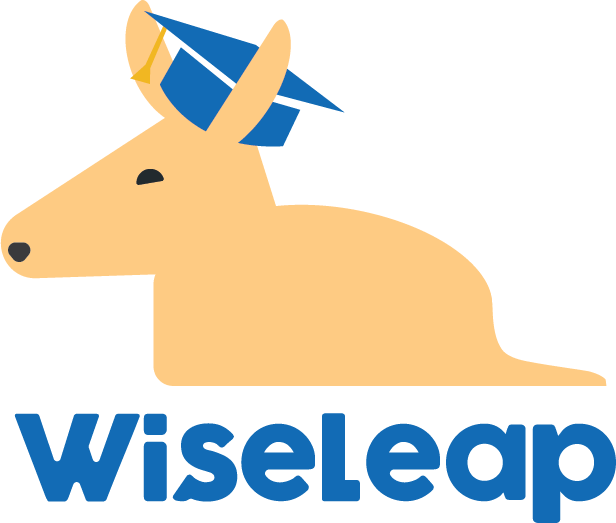

# WiseLeap - Hackathon

 <link href="https://cdn.jsdelivr.net/npm/bootstrap@5.3.3/dist/css/bootstrap.min.css" rel="stylesheet"
        integrity="sha384-QWTKZyjpPEjISv5WaRU9OFeRpok6YctnYmDr5pNlyT2bRjXh0JMhjY6hW+ALEwIH" crossorigin="anonymous">

 

O projeto WiseLeap é voltado para pessoas que estão enfrentando ou
enfrentaram problemas de aprendizado, visando recuperar o conhecimento perdido,
incluindo pessoas que abandonaram a escola ou que nunca tiveram contato com uma
educação formal.  Como nosso projeto visa o básico, pessoas que frequentam escolas
e têm dificuldades podem usá-lo como reforço, além de ter um limpo e intuitivo, tudo
isso para proporcionar um ambiente de aprendizado saudável, levando a escola até
você! 

<h3>Acesse o projeto: https://matheussps.github.io/WiseLeap-Hackathon/</h3>

Kenzetes - Todos os
direitos reservados

